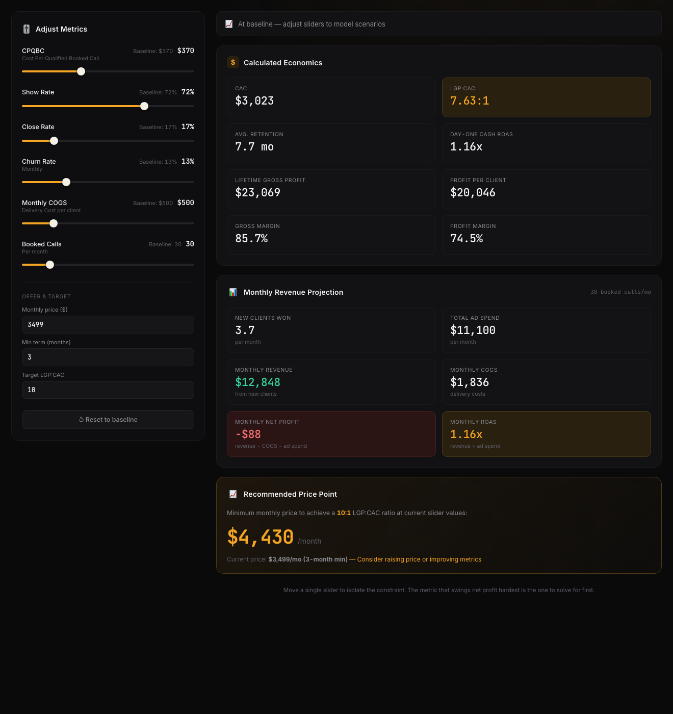

# Growth Constraint Modeler

A live unit-economics calculator for AI agencies scaling with paid ads. Move the sliders to find the **single constraint** holding back profitable growth — the metric that swings net profit hardest is the one to solve for first.



## The idea

When an agency owner wants growth and uses ads as the vehicle, "should I spend more?" is the wrong question. The right question is: **which constraint is capping my economics right now — acquisition cost, show rate, close rate, churn, delivery cost, or volume?**

This tool makes that visible. Set your real funnel numbers as the baseline, then drag one slider at a time and watch every downstream metric recompute live. The lever that flips monthly net profit from red to black is your constraint.

## Inputs (sliders)

| Slider | Meaning |
| --- | --- |
| **CPQBC** | Cost Per Qualified Booked Call — your blended ad cost to book one qualified call |
| **Show Rate** | % of booked calls that actually show |
| **Close Rate** | % of shown calls that close |
| **Churn Rate (monthly)** | % of clients lost per month |
| **Monthly COGS** | Delivery / fulfillment cost per client per month |
| **Booked Calls / month** | Top-of-funnel volume |

Plus three offer/target fields: **monthly price**, **minimum term**, and your **target LGP:CAC ratio**.

## The model

Every output is derived from the sliders — no magic numbers.

```
closeProb       = showRate × closeRate          // a booked call → a client
newClients/mo   = bookedCalls × closeProb
adSpend/mo      = bookedCalls × CPQBC
CAC             = CPQBC ÷ closeProb              // = adSpend ÷ newClients
retention (mo)  = 1 ÷ churnRate

monthlyRevenue  = newClients × price
monthlyCOGS     = newClients × COGS
monthlyNetProfit= monthlyRevenue − monthlyCOGS − adSpend
monthlyROAS     = monthlyRevenue ÷ adSpend
dayOneCashROAS  = price ÷ CAC

lifetimeGrossProfit (LGP) = (price − COGS) × retention
profitPerClient = LGP − CAC
grossMargin     = (price − COGS) ÷ price
profitMargin    = profitPerClient ÷ (price × retention)
LGP:CAC         = LGP ÷ CAC

recommendedPrice = (targetRatio × CAC ÷ retention) + COGS   // price to hit your target LGP:CAC
```

**LGP:CAC** is the headline health metric. A 3:1 is survivable; 10:1+ means you can pour fuel on the fire. If you're below target, the *Recommended Price Point* card tells you the price that would get you there at your current funnel metrics — or you go fix a slider instead.

## Run locally

It's a static site — no build step.

```bash
# any static server works
python3 -m http.server 4178
# then open http://localhost:4178
```

## Deploy

Deploys to Vercel as a static site with zero config (`vercel.json` included).
The repo is connected to the Vercel project, so every push to `master`
auto-deploys to production.

Live: https://ad-economics-calculator.vercel.app

## Files

- `index.html` — structure
- `style.css` — dark dashboard theme
- `app.js` — the model + slider wiring (this is where the math lives)
